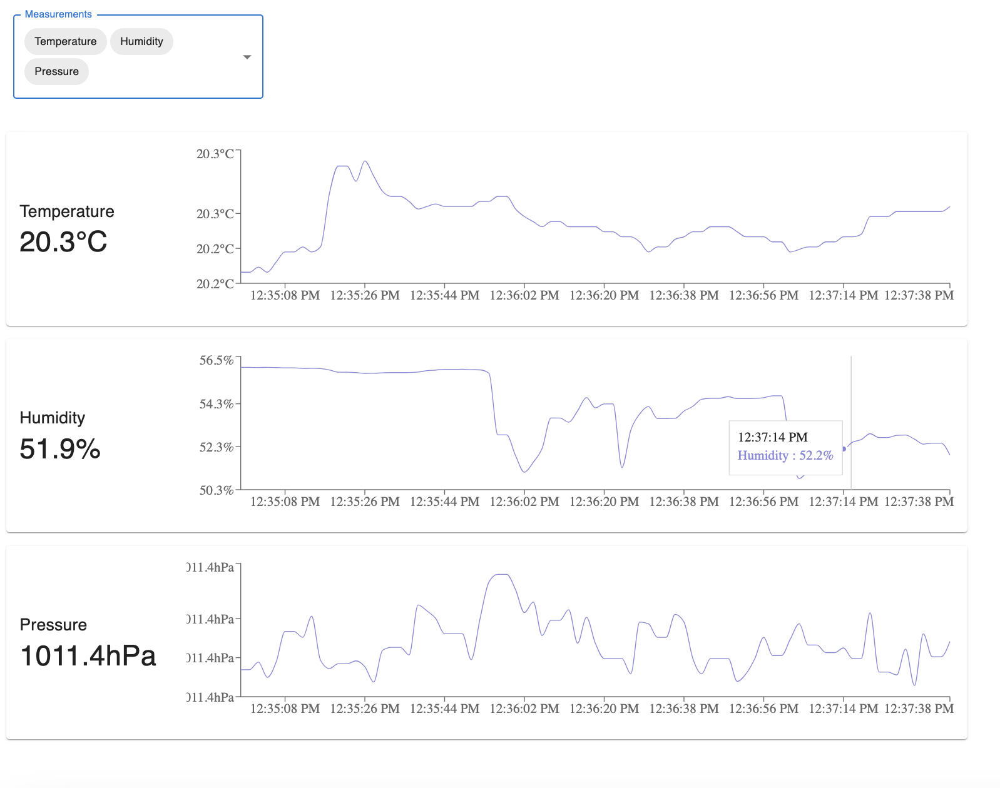

# Arkadia

Arkadia is a project to monitor home environment conditions like temperature, pressure, humidity, and air quality. The goal is to practice working with sensors and various software architecture patterns. All services and sensors are currently running on a single Raspberry Pi 5.

Arkadia is named after the base camp of the Skaikru people in [the TV show "The 100"](https://en.wikipedia.org/wiki/The_100_(TV_series)).

## Getting Started

```bash
cd services
docker compose up
```

## Services

> Unit tests are available for most services by adding `-tests` to the service name. For example, `docker compose run tph-tests` will run the unit tests for the tph service.

### tph

This service measures temperature, prressure and humidity using a BME280 sensor and a Raspberry Pi. It periodically samples sensor data and stores the median values in a Redis cache.

```bash
docker compose run tph
```

### data

This service is a simple FastAPI application that exposes sensor data via a REST API.

```bash
docker compose run data
```

The API documentation is available at `http://localhost:8000/docs`. There is currently only [one endpoint](http://localhost:8000/api/v1/tph) — the endpoint that retrieves tph data.

### web

This service is a React application that displays sensor data.

```bash
docker compose run web
```

An example screenshot of the web application:


